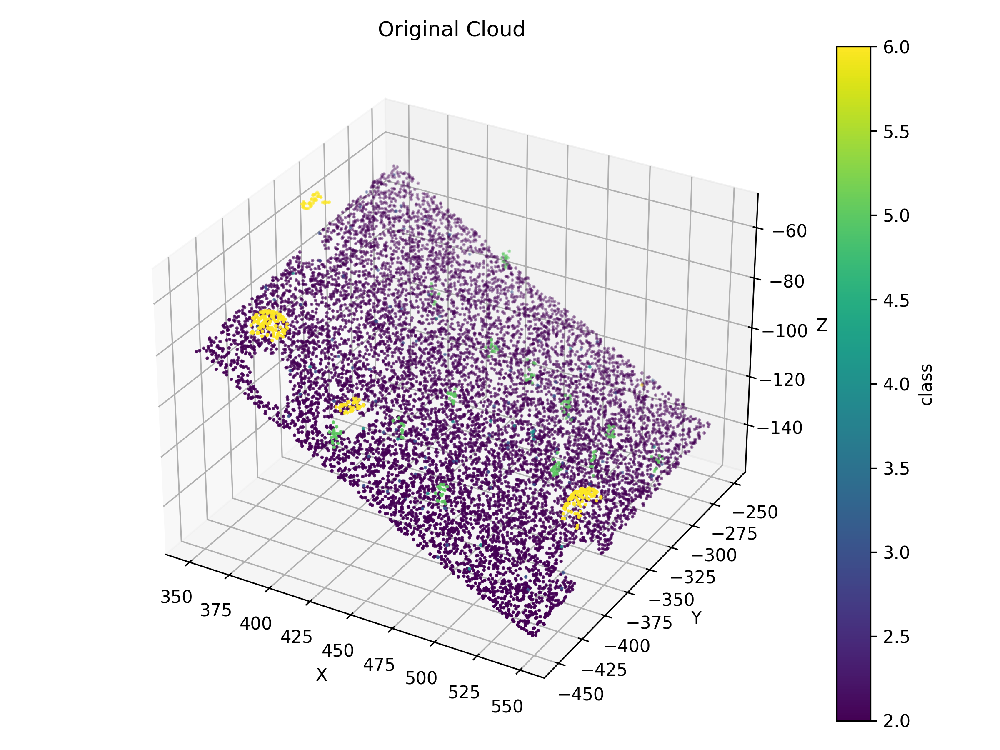
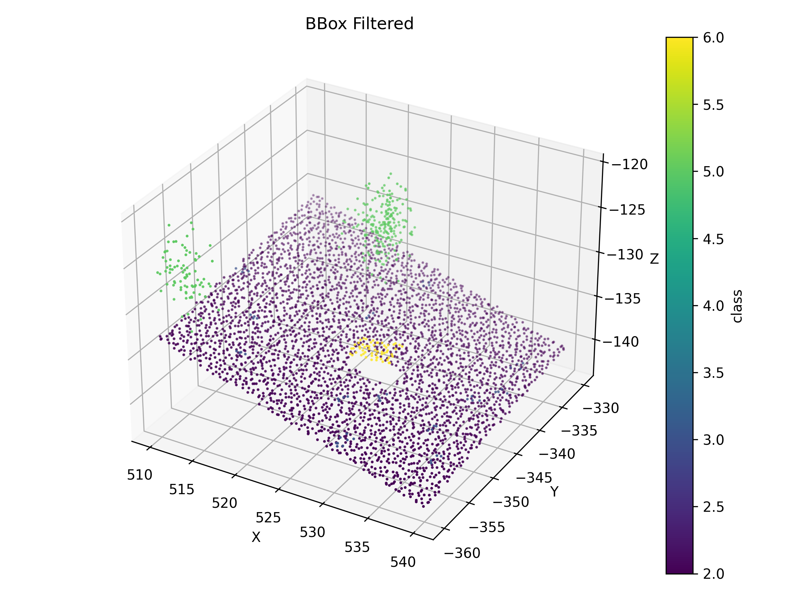
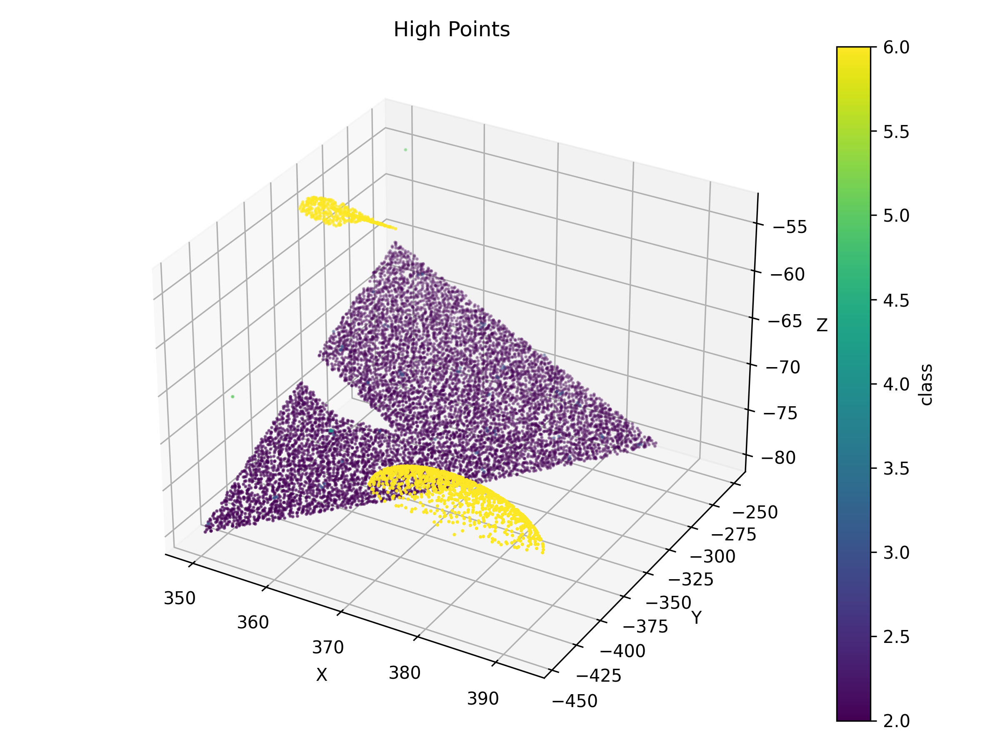
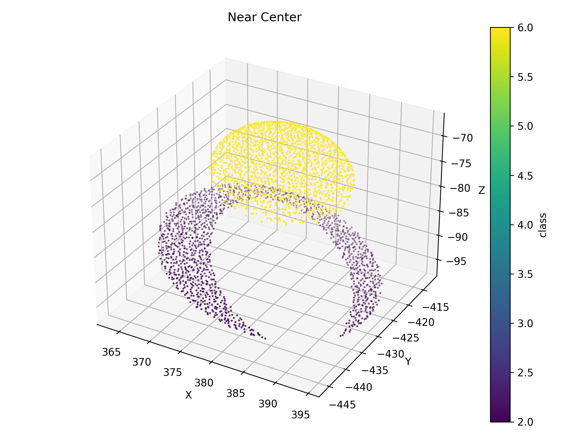

# Отчёт к заданию 2b

## Оригинальное облако точек

  

## 1) Какие области выделены и почему

### Bounding box

Выделялся по диапазонам X/Y/Z (xmin..xmax, ymin..ymax, zmin..zmax). Используется для быстрого извлечения интересующей пространственной области.

[ссылка на облако точек](https://drive.google.com/file/d/1fknp2snIw4ougAfL3szjEn-8JxqDpJUA/view?usp=sharing)

  

### Фильтр по высоте (Z > threshold)

Позволяет отделить низкие объекты (почву, дорожное покрытие) от высоких (деревья, крыши, мачты).

[ссылка на облако точек](https://drive.google.com/file/d/1VTsUgpT4UJfqn8uHVbR65uLvHNou1J3r/view?usp=sharing)

  

### Фильтр по расстоянию от точки (сфера)

Выбирает локализованные объекты вокруг заданной точки (центр, наблюдательный пункт).

[ссылка на облако точек](https://drive.google.com/file/d/1uHvL5A2p5klDvXC0fSSq7jEODF31wgOE/view?usp=sharing)

  

## 2) Количество точек до и после фильтрации

Original points: 158953

BBox filter points: 3838

Height filter points: 16227

Distance filter points: 3175

## 3) Выводы по сравнению результатов

Bounding-box даёт самый прямолинейный контроль над областью — быстро уменьшает объём данных, но может «отрезать» полезные объекты на границе.

Фильтр по высоте хорошо разделяет «землю» и «надземное» — если порог выбран корректно, но если в данных много наклонной местности, простой порог может ошибаться.

Радиусный (distance) фильтр удобен для локальной сегментации; чувствителен к выбору центра и радиуса.

Комбинация фильтров (например, bbox -> distance) даёт лучшие результаты: сначала экономия объёма, затем локализация объекта.