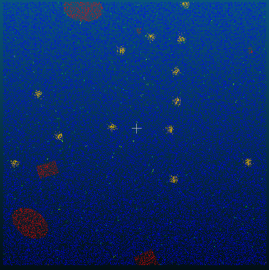
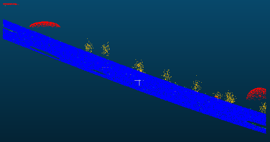
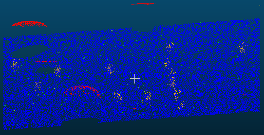
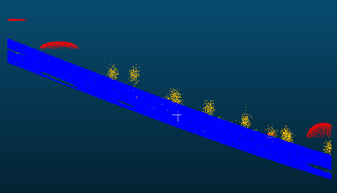
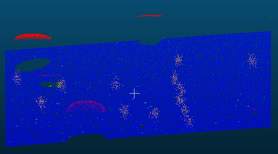
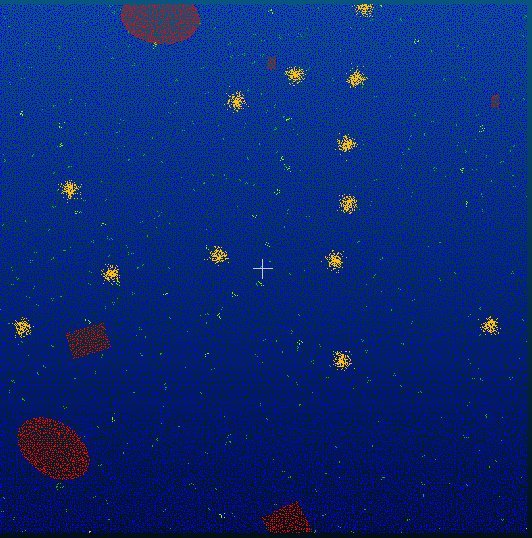
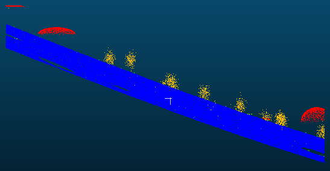
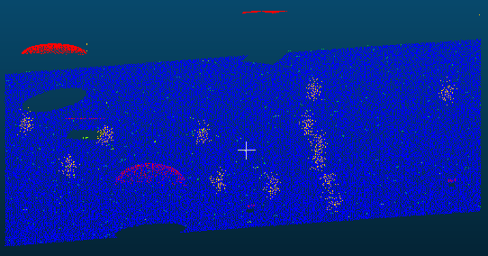

# Отчёт к заданию 1

## Subsampling results

### Random

  
  
  

### Spatial

  
  
  

### Octree

  
  
  

### Таблица

| Метод | Количество точек |
|-------|:----------:|
| Original | 158 953 | 
| Random | 58 953 | 
| Spatial | 65 984 |
| Octree | 76 770 |

## Ответы на вопросы

### 1. Какой метод субсэмплинга дал наилучший визуальный результат при уменьшении количества точек ~втрое?

Spatial показал лучший визуальный результат при уменьшении числа точек ~втрое. Этот метод обеспечивает равномерное распределение точек по поверхности, лучше сохраняет контуры и мелкие геометрические особенности по сравнению со случайной выборкой.

### 2. Как изменяется точность геометрии при различных методах субсэмплинга?

#### Random: 

При малых уровнях уменьшения визуально может выглядеть приемлемо, но статистически вероятность удаления критичных точек (грани, острые края) выше — локальная погрешность растёт. При сильном уменьшении возникают заметные артефакты и «разреженность». 

#### Spatial:

Сохраняет локальные характеристики поверхности лучше всего — расстояние между соседними точками контролируется, что уменьшает искажения геометрии. Точность по нормалям и кривизне поверхности деградирует минимально.  

#### Octree:

Хорошо сохраняет общую форму и крупные структуры, но мелкие детали могут быть сглажены на уровне октав. Искажения зависят от выбранного уровня октавы: при слишком грубом разбиении теряются мелкие элементы, при слишком тонком — мало сокращения размера.

### 3. Какой способ оказался самым быстрым?

Random — самый быстрый по времени исполнения, поскольку алгоритм просто выбирает точки случайным образом без сложных вычислений. Octree и Spatial требовательнее: Spatial требует вычисления расстояний/решётки, Octree — построения и обхода октадревесной структуры.

### 4. Какие параметры были оптимальными для сохранения структуры объекта?

- Spatial: min space between points == 0.57 

- Octree: Subdivision level == 8 

- Random: количество точек == 58 953
