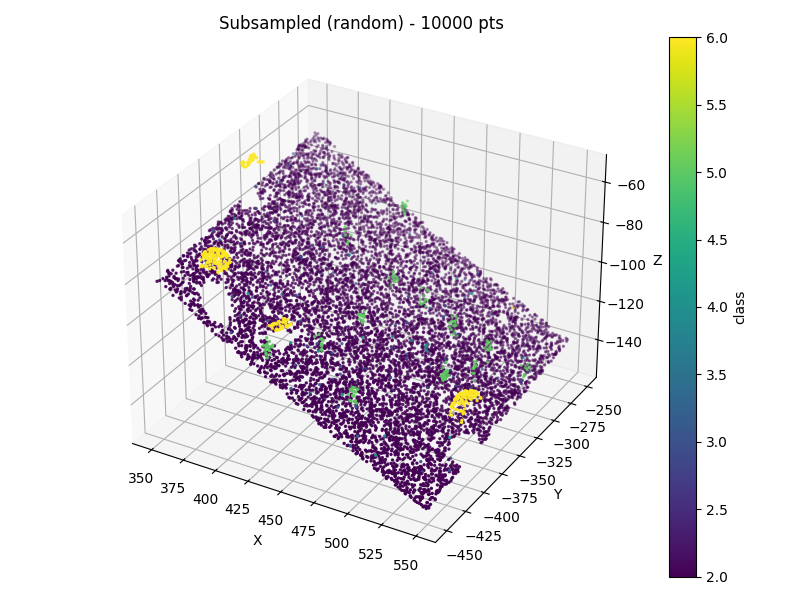
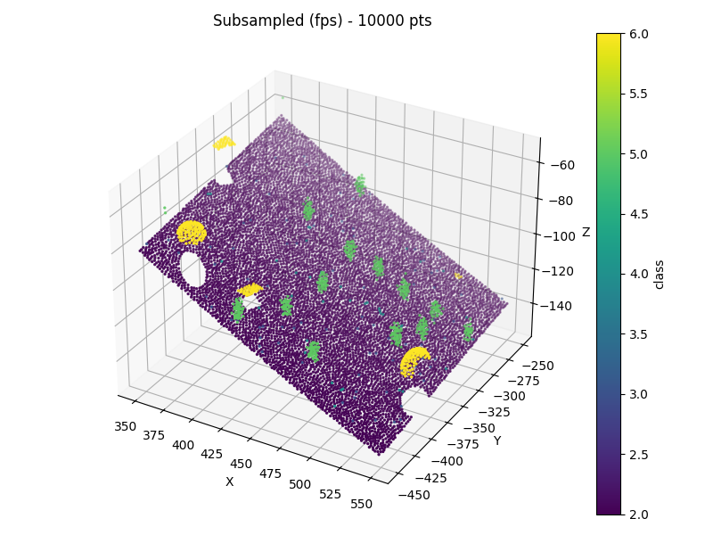

# Отчёт к заданию 1b

## 1) Как влияет размер выборки на визуальное качество облака?

Чем больше точек — тем подробнее и «плавнее» выглядит объект; уменьшение числа точек снижает детализацию и может привести к потере мелких геометрических признаков.

## 2) Как влияет размер вокселя в voxel_grid_subsampling на детализацию?

Меньше воксель — более высокая детализация; больше воксель — сильная агрегация и потеря мелких деталей.

При фиксированном количестве исходных точек увеличение s уменьшает число возвращаемых точек (потому что больше точек попадает в один воксель).

## 3) Какой метод эффективнее по времени?

random_subsampling — самый быстрый (O(N) для генерации индексов и выборки).
time: 0.003 s

voxel_grid_subsampling — обычно чуть медленнее (O(N) для вычисления индексов + время на unique — порядок O(N log N) или амортизированно O(N) в зависимости от реализации).
time: 0.161 s

farthest_point_sampling (FPS) — значительно дороже: O(N·k) (где k — число отбираемых точек); для больших N и k может быть очень медленным.
time: 113.872 s

## 4) Какой метод лучше сохраняет геометрию объекта?

При малом количестве точек FPS обычно лучше сохраняет форму и края; voxel сохраняет общую структуру и выравнивает плотность; random — сохраняет статистику распределения, но хуже для редких/тонких деталей.

### Random

- (+) прост и очень быстрый; сохраняет глобальную статистику распределения точек.

- (-) вероятностно может пропустить редкие, но важные признаки (острые края, узкие кривые).

[ссылка на облако точек](https://drive.google.com/file/d/1QJPucRitzXTyIYllfAObABUBGH_p6o8b/view?usp=sharing)

  

### Voxel grid

- (+) равномерная локальная агрегация, снижает «шум» и переплотнённость; детальность задаётся явно параметром voxel_size. Центроид-агрегация в вокселе улучшает локальную геометрию по сравнению с «первой точкой».

- (-) детали меньше масштаба voxel_size удаляются или размываются. На тонких листовых структурах (тонкие пластины, края) может сильно искажать форму.

[ссылка на облако точек](https://drive.google.com/file/d/1Li9dWN08XKlsHj4TzNYEswQtpvK13AtI/view?usp=sharing)

  

### Farthest Point Sampling (FPS)

- (+) максимизирует покрытие пространства пунктов; хорошо сохраняет контуры и крайние точки; при малом k обеспечивает равномерное покрытие поверхности.

- (-) дорог по времени; неявно не учитывает геометрические нормали/поверхностные метрики (только расстояние в 3D).

[ссылка на облако точек](https://drive.google.com/file/d/1Ctq_1ACSGvilPa4bx4heNsOtHfct1oSB/view?usp=sharing)

  

