# Отчёт к заданию 2

## Результаты сегментации

### Сегмент 1 (случайный)

#### До

  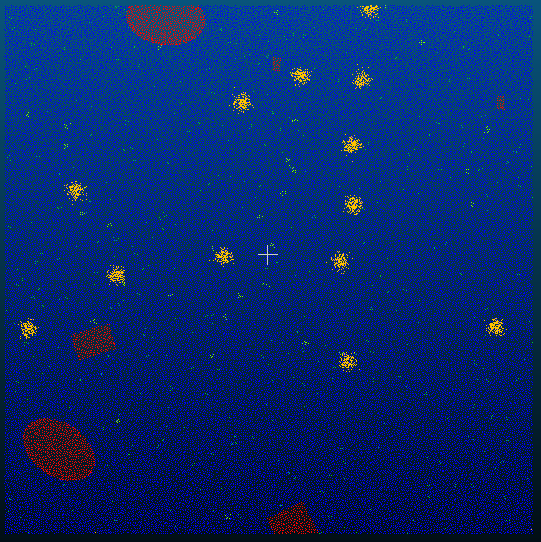
  
  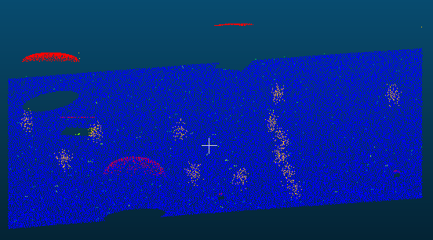

#### После

  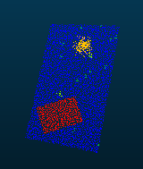
  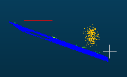
  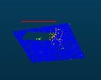

[ссылка на облако](https://drive.google.com/file/d/12e2EUqBp0UnPWJd_0PpGdBcjQQP61D5G/view?usp=sharing)

### Сегмент 2 (no groung)

#### До

  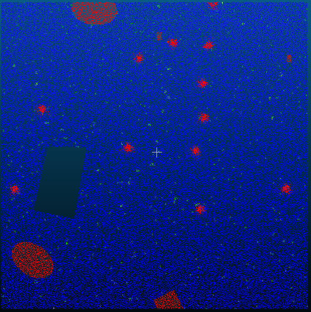
  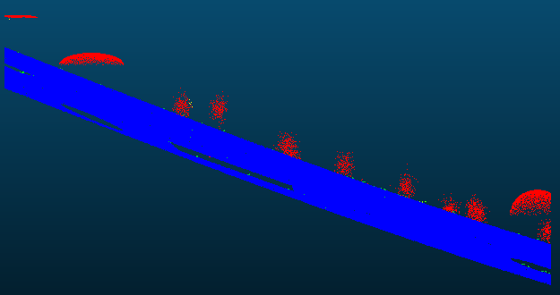
  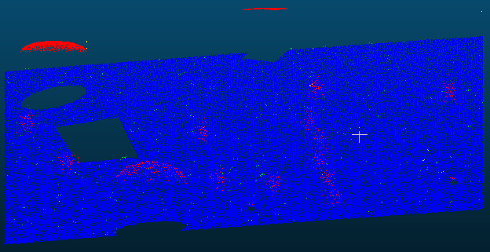

#### После

  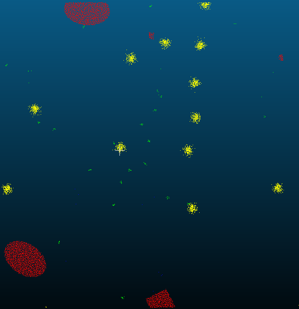
  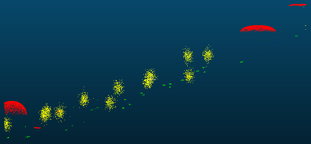
  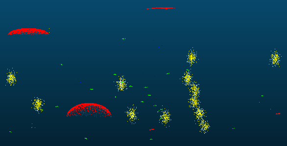

[ссылка на облако](https://drive.google.com/file/d/1gw-f2cygfn0hyPlWaDcbpIGLriHos9Ch/view?usp=sharing)

### Сегмент 3 (yellow spheres -> red spheres)

#### До

  
  
  

#### После

  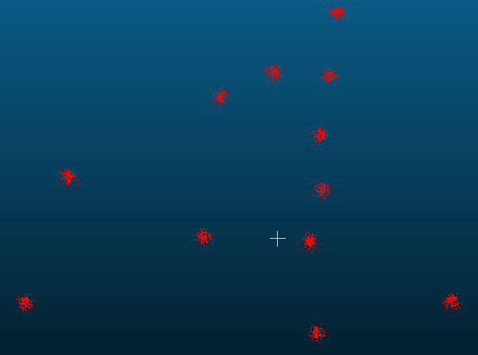
  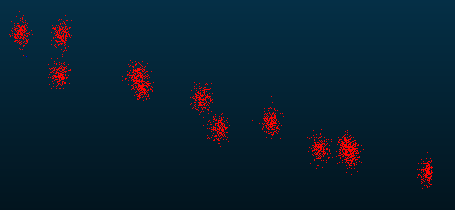
  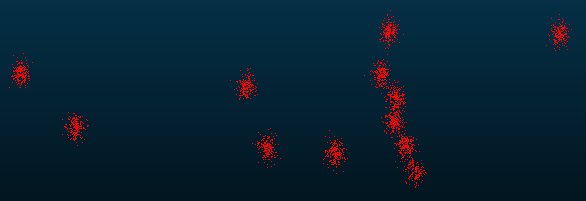

[ссылка на облако](https://drive.google.com/file/d/1DbOGf5qULNB_1TfDk63U_XuKFxzcIdwD/view?usp=sharing)

## Ответы на вопросы

### 1) Когда инструмент Segment работает лучше автоматических методов? 

- объекты чётко различимы глазом, но автоматические алгоритмы ошибочно объединяют соседние структуры (например, перекрывающиеся листья/ветви или тесно стоящие автомобили);  

- сцены с сильной вариативностью плотности точек, шумом или артефактами, которые ломают предположения автоматических методов;

- при необходимости тонкой ручной правки маски после автоматической предобработки (где автомат дал «грубую» сегментацию, а человек корректирует границы).  

### 2) Недостатки ручной сегментации

- ручная разметка медленна и плохо масштабируется на большие облака.  

- разные операторы могут выделять разные границы, что снижает повторяемость результатов.

- некоторые точки могут быть скрыты от текущего ракурса, поэтому требуется много проходов и поворот видов.  

### 3) Что происходит с атрибутами (цвет, интенсивность) после сегментации?

При сохранении выделенного сегмента как нового объекта CloudCompare обычно копирует все атрибуты точек (цвет, интенсивность, нормали, скалярные поля) в новое облако — то есть атрибуты сохраняются и доступны в результате.  

При удалении выделенных точек их атрибуты удаляются вместе с точками из исходного объекта. На рисунках выше показано, что при сегментации с удалением жёлтые сферы сменили цвет на красный.

### 4) Возможные сценарии применения сегментации

#### Строительство и архитектура:

Отделение фасадов, конструкций или отдельных элементов для детального анализа/моделирования.  

#### Экология и лесное хозяйство: 

Выделение отдельных деревьев или крон для учёта древесной биомассы, подсчёта деревьев, анализа состояния.  

#### Археология: 

Отделение артефактов и структур от грунта/засорений при анализе наземного или аэрофотолазного сканирования.

#### Геодезия и инвентаризация:

Удаление «мусора» (движущиеся объекты, эхо‑артефакты) и выделение целевых объектов (бордюры, столбы, дорожные знаки).  

#### Транспорт и безопасность:

Выделение автомобилей на парковке для учёта, анализа расположения, или для подготовки данных к автоматическому распознаванию. 
