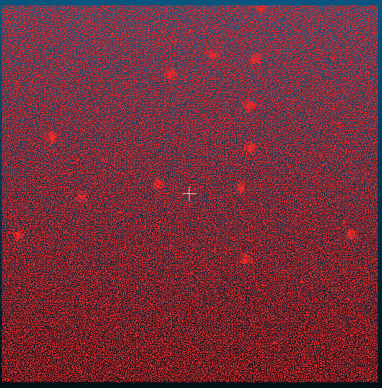
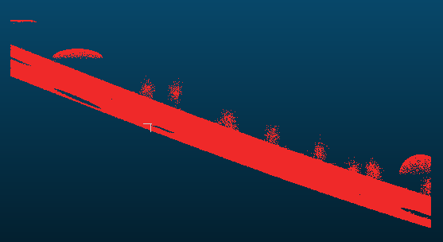
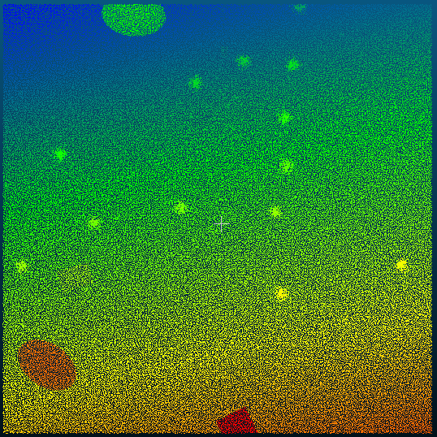
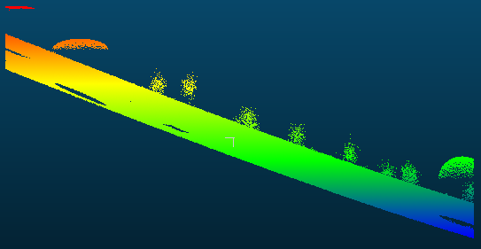

# Отчёт к заданию 1

## Результаты

### Применение одного цвета

  
  

### Градация по высоте

  
  

## Ответы на вопросы

### Что такое RGB-цвета в облаке точек и зачем они используются?

Три канала (Red, Green, Blue) для хранения истинного цвета точек — используются для визуализации и классификации материалов.

### Какие форматы файлов поддерживают хранение цветовой информации в CloudCompare?

PLY, LAS/LAZ, PCD, E57 и некоторые бинарные/текстовые форматы с RGB.

### Как проверить, содержит ли облако точек цветовую информацию?

В панели Properties — блок "Colors" или наличие RGB-каналов при открытии файла.

### Что делает функция Set Color и в каких случаях она применяется?

Назначает всем точкам один фиксированный цвет (выделение, маскирование, экспорт).

### Чем отличается функция Height Ramp от просто установки цвета?

Height Ramp раскрашивает по значению (обычно Z) градиентом, даёт количественную визуализацию, в отличие от однотонного цвета.

### Можно ли применить цветовую градацию не только по высоте? Если да, то как?

Да — по любому активному скалярному полю (интенсивность, плотность и т.п.) — выбрать SF и применить Ramp.

### Как работает функция Convert to Grey Scale и чем может быть полезна?

Переводит RGB в яркость (градации серого) — полезно для анализа яркости и упрощённой визуализации.

### Как изменяется визуализация облака точек при использовании Invert?

Цвета меняются на противоположные (инверсия каналов), что подчёркивает контрасты.

### Какие ограничения существуют при использовании цветовых функций, если облако точек не содержит RGB?

Некоторые операции по RGB недоступны; требуется активное скалярное поле для Ramp.

### Какие преимущества даёт визуализация облака точек с помощью цветовой градации?

Облегчает интерпретацию числовых распределений, обнаружение аномалий и структурных изменений.

### Приведите 2–3 примера практического применения Height Ramp в инженерных задачах.

Анализ высот здания (этажность), рельефа для гидрологии, оценка деформаций по высоте.

### В чём разница между цветами, назначенными вручную, и цветами по скалярному полю?

Ручные — семантические/визуальные; по SF — отражают числовые значения и меняются локально.

### Как можно использовать цветовую информацию для анализа рельефа, фасадов или архитектурных объектов?

Выявлять материалы, повреждения, высотные различия и отделять элементы по цвету/интенсивности.

### Почему важно сохранять цветовую информацию при экспорте облаков точек?

Чтобы сохранить визуальную и семантическую информацию для дальнейшего анализа и обмена данными.

### Можно ли передавать информацию о плотности или интенсивности точек через цвет? Как это реализуется в CloudCompare?

Да — вычислить/использовать соответствующее скалярное поле (density/intensity) и применить цветовую рампу к нему.

### Что произойдёт, если применить Height Ramp к облаку, у которого отключено или отсутствует скалярное поле?

Рампа не отобразится корректно; нужно активировать или создать SF (например Z) перед применением.

### Как можно сравнить два облака точек визуально с помощью цветовой информации?

Окрасить одно и другое разными палитрами или вычислить поле разницы и раскрасить по нему.

### Возможно ли редактировать только часть облака точек по цвету? Какими инструментами это делается?

Да — выделением (Scissors/Crop/Segment) и применением Set Color или Ramp только к выделению.

### Как связаны скалярные поля и цвет в CloudCompare?

Скалярные поля дают числовые значения для каждой точки; цвет отображает эти значения через палитру.

### Какие действия необходимо выполнить, чтобы активировать скалярное поле для окраски по высоте?

Edit → Scalar fields → Set SF as active (например Z), затем Edit → Colors → Height Ramp.

### Как можно отменить результат применения Height Ramp, если он не подошёл?

Отменить через Undo (Ctrl+Z) или вернуть исходный файл из сохранённой копии.

### Что обозначают параметры "Min" и "Max" при работе с цветовой шкалой?

Границы диапазона скалярного поля, соответствующие началу и концу цветовой палитры.

### Как сохранить изменения цвета, чтобы они были видны при повторном открытии файла?

Сохранить в формате, поддерживающем цвета (PLY, LAS и т.п.) через File → Save с включённым экспортом цветов.
