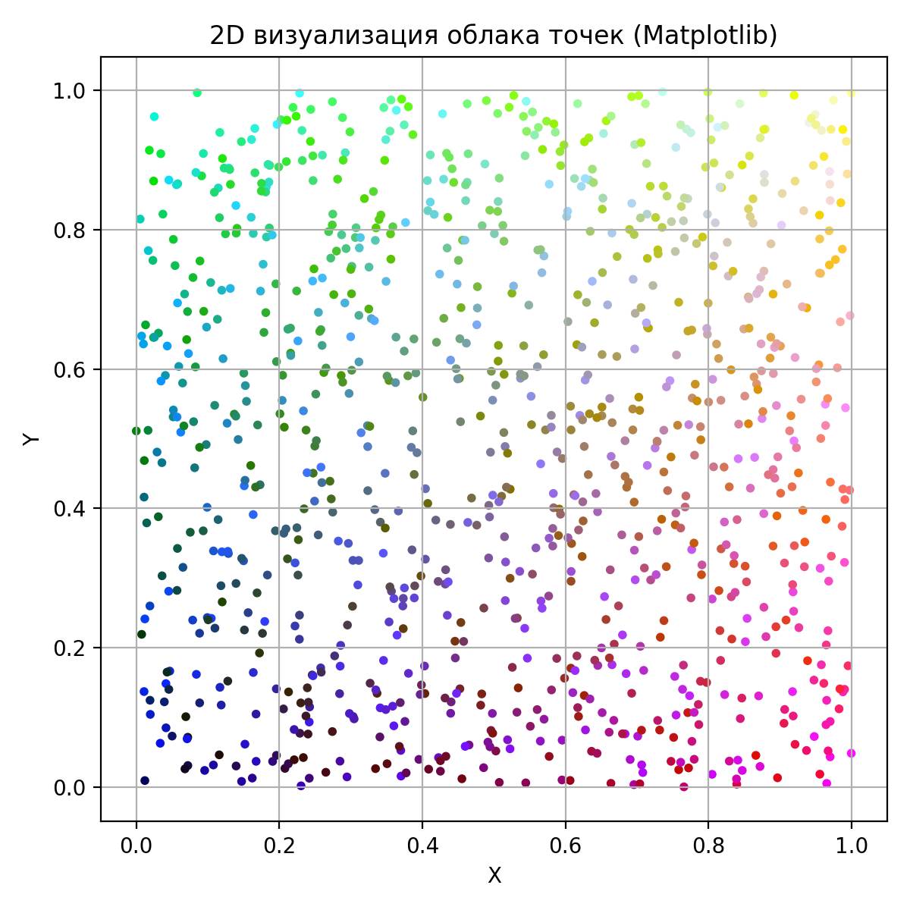
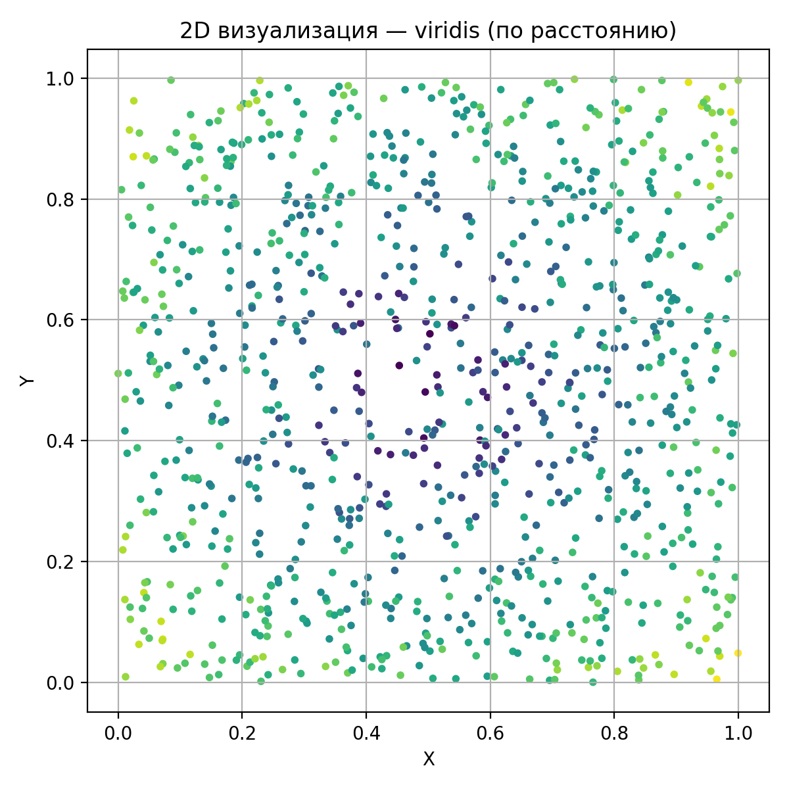

# Отчёт к заданию 2

## Результаты

### Облако точек (2D)

  
  

### Облако точек (3D)

[plotly](https://kiri4s.github.io/CVin3D12/src/lesson2/task2/outputs/points_3d_plotly.html)

[plotly_alt](https://kiri4s.github.io/CVin3D12/src/lesson2/task2/outputs/points_3d_plotly_alt.html)

## Ответы на вопросы

### Почему для RGB значения используются числа от 0 до 1 или от 0 до 255?
0–255 — целочисленное 8‑битное представление; 0–1 — нормализованное float‑представление для удобства вычислений и интерполяций.

### Как можно задать цвет точек на основе скалярной величины?
Использовать нормализованную скалярную величину и применить colormap (например, plt.cm.viridis) для получения RGB.

### Чем отличается статичная визуализация (Matplotlib) от интерактивной (Plotly)?
Matplotlib — статичная картинка для публикаций; Plotly — интерактивная (вращение, масштаб, подсказки) для исследования данных.

### Можно ли использовать другую цветовую карту (colormap) в Matplotlib? Как?
Да — передать аргумент cmap в функции (например, plt.scatter(..., c=vals, cmap='viridis')).

### Что произойдёт, если не нормализовать значения при генерации цветов?
Цвета могут быть некорректно интерпретированы (переполнение или отсутствие градации); визуализация станет неправильной.

### Что такое облако точек и какие данные оно обычно содержит?
Набор точек в 2D/3D, обычно содержит координаты (X,Y,Z) и опционально дополнительные атрибуты (цвет, интенсивность, класс).

### Как представляется цвет в модели RGB?
Три компоненты — красный, зелёный, синий (R,G,B), задающие итоговый цвет при смешении.

### В каком диапазоне должны находиться значения RGB для визуализации?
Либо 0–255 (integer), либо 0.0–1.0 (float) — оба варианты общеприняты и взаимоприводимы.

### Что такое нормализация значений и зачем она нужна при работе с цветами?
Приведение чисел к единому диапазону (например, 0–1) для корректного отображения и применения colormap.

### Чем отличается абсолютный цвет от вычисляемого (например, от координаты или расстояния)?
Абсолютный — фиксированное значение; вычисляемый — зависит от данных (координат, расстояний, метрик) и кодирует информацию визуально.

### Как с помощью NumPy можно задать цвет каждой точке на основе её координаты?
Сформировать массив цветов, например colors = points (или привязать отдельные функции к X/Y/Z) и нормализовать его для визуализации.

### Как вычислить расстояние от точки до центра пространства с помощью NumPy?
dist = np.linalg.norm(points - center, axis=1).

### Как задать градиент цвета по оси X, Y или Z?
Взять соответствующую координату, нормализовать её по минимуму/максимуму и применить colormap к полученной шкале.

### Как преобразовать массив float значений в нормализованный массив для colormap?
norm = (vals - vals.min()) / (vals.max() - vals.min()).

### Как используется параметр c= в функции plt.scatter() ?
Параметр c принимает скаляр или массив значений, которые отображаются цветовой картой (вместе с cmap).

### Что такое colormap в Matplotlib и как его применить к облаку точек?
Colormap — отображение скалярных значений в цвета; применяется через cmap в plt.scatter или через plt.cm.<name>.

### Какие бывают цветовые карты (colormaps) и как выбрать подходящую?
Существуют последовательные, diverging, qualitative карты; выбирать по типу данных (градиент — для непрерывных, категориальные — для классов).

### Как отобразить цветовую шкалу (legend) на графике?
Использовать plt.colorbar() для отображения шкалы, связанной с параметром c.

### Как создаётся 3D-график с помощью plotly.graph_objects ?
Использовать go.Scatter3d с параметрами x,y,z и marker (size, color, colorscale или списком 'rgb(R,G,B)').

### Как задать цвет каждой точки вручную в формате 'rgb(R,G,B)' в Plotly?
Передать список строк вида 'rgb(12,34,255)' в marker.color при создании go.Scatter3d.

### В чём преимущества интерактивной визуализации по сравнению со статичной?
Интерактивность позволяет исследовать данные (вращение, масштаб, подсказки), выявлять детали и аномалии в реальном времени.

### Какие параметры можно задать в Plotly для изменения внешнего вида маркеров?
size, symbol, opacity, line (width, color), colorscale, reversescale и т.д.

### Как можно сохранить облако точек с цветами в файл (например, .ply , .csv )?
Экспортировать координаты и цвета в нужный формат (CSV с колонками R,G,B или PLY с вершинными цветами) с помощью numpy/pandas/plyfile и т.п.

### Как можно использовать цвет как способ отображения дополнительных данных (температура, интенсивность, категория и т.д.)?
Сопоставить значение каждой точки с цветовой шкалой или категорией, используя colormap или предопределённую палитру для классов.

### Что произойдёт, если задать некорректные значения RGB (например, больше 1.0 или отрицательные)?
Результат будет неопределён: цвета могут отобразиться некорректно или вызвать ошибку; требуется предварительная нормализация/клиппинг.

### Как можно применить цветовую визуализацию при анализе (ландшафта, сканов зданий, 3D‑моделей, научных данных)?
Использовать цвет для кодирования высоты, интенсивности отражённого сигнала, классификации объектов или физических величин (температура и т.д.).

### Как можно визуализировать разные классы точек (например, "земля", "растительность", "здания") с помощью цветов?
Назначить каждой категории уникальный цвет или палитру и отобразить их отдельно или с легендой.

### Что лучше выбрать для презентации результатов: Matplotlib или Plotly? Почему?
Для статичных отчётов — Matplotlib (контроль над оформлением); для демонстрации и исследования — Plotly (интерактивность).
