# Отчёт к заданию 3

## Результаты

### Добавление и изменение скалярного поля

#### Создание скалярного поля с константой 10

  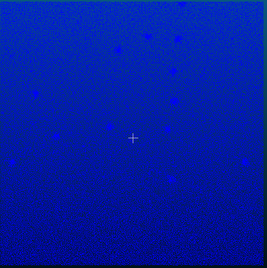
  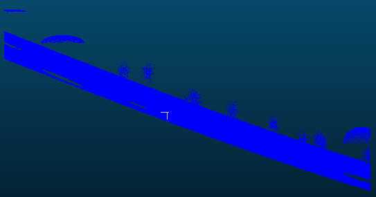

#### Умножение на 2

  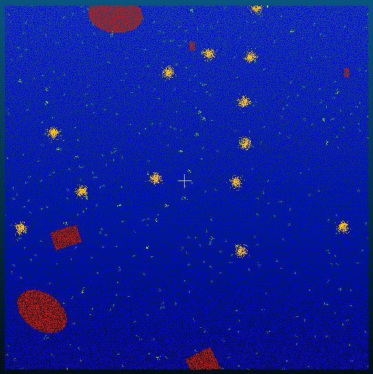
  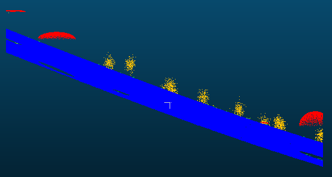

#### Добавление константы 5

  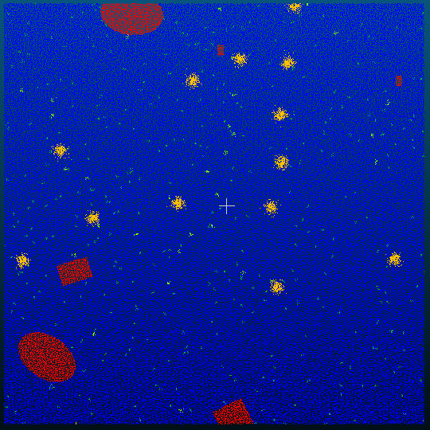
  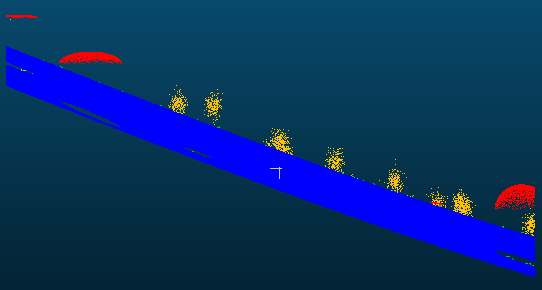

### Сглаживание и фильтрация

#### Фильтр Гаусса std=2

  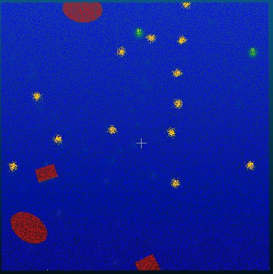
  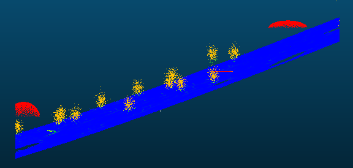

#### Фильтр Гаусса std=5

  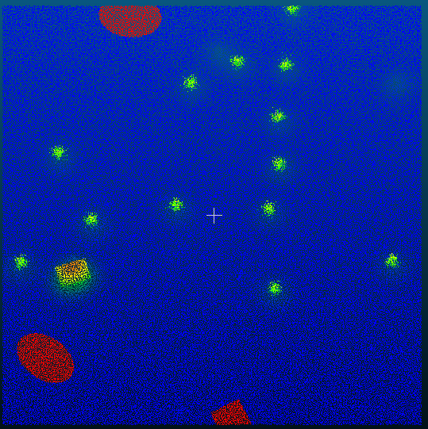
  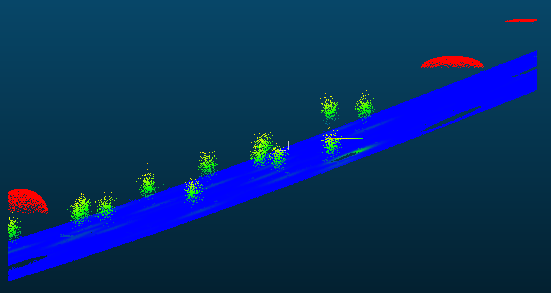

#### Фильтрация по значению [10; 11]

  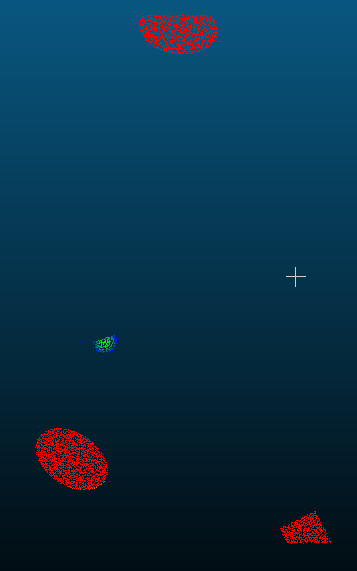

### Анализ и нормализация

#### Статистические параметры

  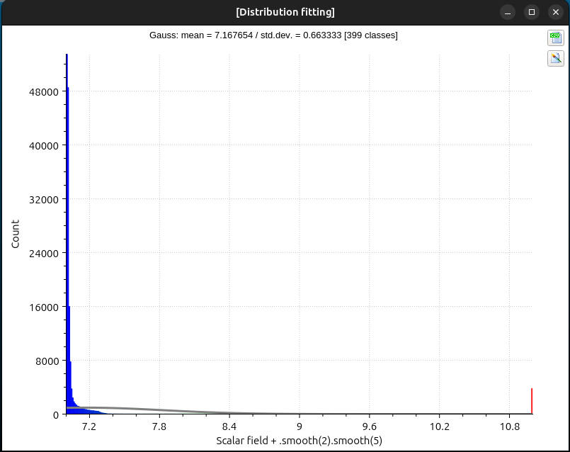

#### Замена координаты на скалярное поле

  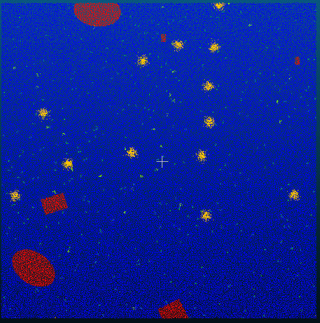
  

### Интерполяция и градиент

#### Градиент

  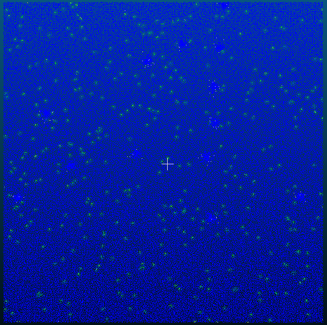
  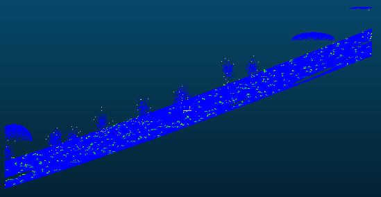

## Ответы на вопросы

### Какая команда используется для создания скалярного поля с постоянным значением?
Команда **Add constant SF** (Edit → Scalar Fields → Add constant SF) позволяет создать новое скалярное поле, где всем точкам облака присваивается одно и то же заданное значение.

### Для чего применяется команда Multiply SF?
Команда **Multiply SF** используется для умножения всех значений активного скалярного поля на заданный коэффициент, что позволяет масштабировать данные.

### Что делает команда Gaussian filter SF и какие параметры она использует?
**Gaussian filter SF** применяет гауссово сглаживание к скалярному полю. Основной параметр — радиус фильтра, который определяет область усреднения значений для каждой точки.

### Чем отличается Smooth SF от Gaussian filter SF?
**Smooth SF** выполняет более простое усреднение значений соседних точек, в то время как **Gaussian filter SF** использует взвешенное усреднение с гауссовым распределением весов, что даёт более плавный результат.

### Для чего нужна команда Filter by value?
**Filter by value** позволяет отфильтровать точки облака по диапазону значений скалярного поля, оставляя только те точки, значения которых попадают в заданный интервал.

### Что показывает команда Compute stat. parameters?
**Compute stat. parameters** вычисляет и отображает статистические характеристики скалярного поля: минимум, максимум, среднее значение, стандартное отклонение, дисперсию и другие параметры.

### Зачем нормализовать скалярное поле (Normalize SF)?
Нормализация приводит все значения скалярного поля к единому диапазону [0..1], что упрощает сравнение разных полей, визуализацию и применение некоторых алгоритмов обработки.

### Что делает команда Set SF as coordinate?
**Set SF as coordinate** заменяет одну из пространственных координат (X, Y или Z) значениями из активного скалярного поля, что может использоваться для создания рельефа или деформации облака.

### Для чего используется команда Interpolate SF?
**Interpolate SF** заполняет пропущенные или нулевые значения в скалярном поле путём интерполяции на основе значений соседних точек.

### Что вычисляет команда Gradient?
**Gradient** рассчитывает пространственный градиент скалярного поля — скорость изменения значений в пространстве, что полезно для анализа перепадов и выявления границ.

### Зачем нужна команда Convert to RGB?
**Convert to RGB** преобразует значения скалярного поля в цветовую карту RGB, что позволяет визуализировать распределение значений непосредственно на облаке точек в виде цветового градиента.

### Когда следует использовать Delete current SF?
**Delete current SF** удаляет текущее активное скалярное поле, когда оно больше не требуется или для освобождения памяти при работе с большими облаками точек.