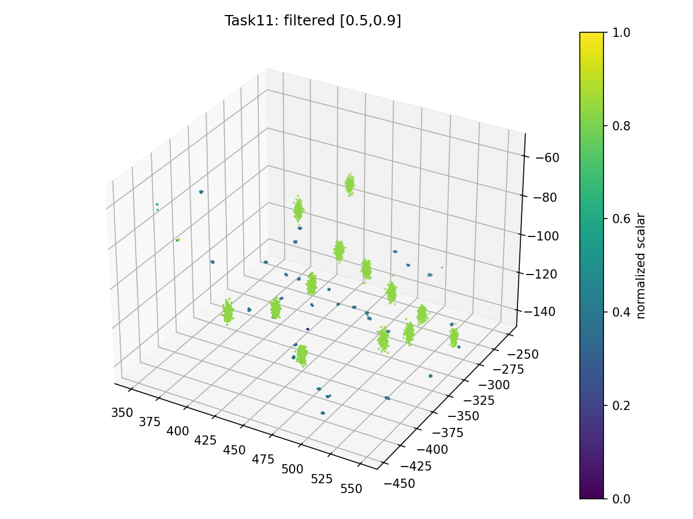

# Отчёт к заданию 4

## Результаты

### Добавить скалярное поле с постоянным значением 10

  

### Умножить скалярное поле на число

  

### Добавить число к значениям скалярного поля

  

### Применить гауссов фильтр (сглаживание)

  

### Повторное сглаживание (скользящее среднее)

  

### Преобразовать скалярное поле в RGB цвета

  

### Вычислить статистические параметры

  

### Нормализовать значения в диапазон [0, 1]

  

### Интерполировать скалярное поле (заполнение пропусков)

  

### Фильтрация по значению скалярного поля

  

### Использовать скалярное поле как координату

  

## Ответы на вопросы

### 1. Что такое облако точек? Какие данные оно обычно содержит?

Облако точек — это набор точек в трёхмерном пространстве, обычно содержащий координаты X, Y, Z, а также дополнительные атрибуты: цвет (RGB), интенсивность отражения, нормали и другие скалярные поля.

### 2. Что такое скалярное поле в контексте облака точек?

Скалярное поле — это числовое значение, привязанное к каждой точке облака. Оно представляет собой одномерную величину (температура, высота, интенсивность и т.д.), в отличие от векторных полей.

### 3. Как можно связать скалярное поле с точками?

Скалярное поле связывается с точками через массив той же длины, что и количество точек, где каждый элемент массива соответствует значению поля для конкретной точки с тем же индексом.

### 4. Приведите примеры реальных скалярных полей (например, в данных LIDAR или фотограмметрии)

Примеры: интенсивность отражения лазера (LIDAR), высота над уровнем моря, температура поверхности, индекс растительности (NDVI), количество возвратов сигнала, угол наклона поверхности, текстурные характеристики.

### 5. Как с помощью NumPy создать массив скалярных значений для точек?

Используя функции: `np.full(n, value)` для постоянного значения, `np.zeros(n)`, `np.ones(n)`, `np.random.rand(n)` для случайных значений, или `np.array([...])` для конкретных значений.

### 6. Как добавить к каждому значению скалярного поля постоянную величину?

Операцией сложения: `scalar_field = scalar_field + constant` или `scalar_field += constant`.

### 7. Как умножить все значения скалярного поля на коэффициент?

Операцией умножения: `scalar_field = scalar_field * coefficient` или `scalar_field *= coefficient`.

### 8. Что произойдёт с данными при нормализации скалярного поля в диапазон [0, 1]?

Минимальное значение станет 0, максимальное — 1, остальные значения линейно масштабируются между ними. Относительные расстояния между значениями сохраняются, но абсолютные величины изменяются.

### 9. Какие статистические параметры можно вычислить для скалярного поля?

Среднее (`mean`), стандартное отклонение (`std`), дисперсия (`var`), минимум (`min`), максимум (`max`), медиана (`median`), квартили, размах, коэффициент вариации.

### 10. Как интерпретировать значения: минимум, максимум, среднее, дисперсия?

Минимум/максимум — границы диапазона значений; среднее — центральная тенденция данных; дисперсия (и std) — мера разброса значений относительно среднего (чем больше, тем неоднороднее поле).

### 11. Для чего используется гауссов фильтр при обработке скалярных полей?

Для сглаживания данных и удаления шума. Гауссов фильтр взвешивает соседние значения по колоколообразной кривой, сохраняя общую форму сигнала лучше, чем простое усреднение.

### 12. Чем отличается гауссов фильтр от скользящего среднего?

Гауссов фильтр применяет взвешенное усреднение с весами по нормальному распределению (больший вес ближним точкам), а скользящее среднее использует равные веса для всех точек в окне.

### 13. Как можно визуализировать скалярное поле, используя цветовую карту?

Нормализовать значения в [0, 1], применить цветовую карту (например, `plt.cm.viridis`, `jet`, `coolwarm`), получить RGB значения и назначить их как цвета точкам.

### 14. Зачем может понадобиться использовать скалярное поле в качестве координаты (например, заменив Z)?

Для визуализации рельефа по скалярному значению, создания профилей высот, анализа зависимостей или представления 4D данных в 3D пространстве.

### 15. Что произойдёт с визуализацией, если применить некорректную нормализацию?

Возможны артефакты: все точки одного цвета (при делении на ноль), обрезка значений, инверсия цветовой схемы, потеря контраста или выход за пределы допустимого диапазона цветов.

### 16. Как можно обнаружить пропущенные значения в скалярном поле?

Использовать `np.isnan(scalar_field)` для поиска NaN значений, `np.isinf()` для бесконечностей, или проверять на специальные маркеры пропусков (например, -9999).

### 17. Что такое интерполяция и как она может быть реализована в NumPy/Scipy?

Интерполяция — восстановление пропущенных значений на основе известных. Реализуется через `scipy.interpolate.interp1d`, `griddata`, `LinearNDInterpolator` или заполнение методами `fillna` с различными стратегиями.

### 18. Как отфильтровать точки по условию, заданному на значения скалярного поля?

Создать булеву маску условием: `mask = (scalar_field >= min_val) & (scalar_field <= max_val)`, затем применить к массивам: `filtered_points = xyz[mask]`.

### 19. Какие библиотеки Python можно использовать для: визуализации 3D-облаков точек (назовите 1–2), сглаживания/фильтрации данных, работы с цветом?

Визуализация 3D: Open3D, Matplotlib (mplot3d), PyVista, Plotly. Фильтрация: SciPy, NumPy, scikit-image. Работа с цветом: Matplotlib (colormaps), seaborn, PIL/Pillow.

### 20. Опишите пошагово, как бы вы добавили скалярное поле к облаку точек и окрасили его по этому полю

1) Загрузить координаты точек
2) Создать/вычислить скалярное поле
3) Нормализовать значения в [0,1]
4) Применить цветовую карту для получения RGB
5) Назначить цвета точкам
6) Визуализировать

### 21. Почему важно сглаживать скалярные поля перед анализом?

Сглаживание удаляет шум и случайные флуктуации, выявляет истинные тренды, улучшает стабильность вычислений производных и градиентов, снижает влияние выбросов на результаты анализа.

### 22. Что будет, если применить гауссов фильтр с очень большим значением σ?

Произойдёт сильное размытие: мелкие детали исчезнут, поле станет почти однородным, приближаясь к среднему значению. Локальные особенности будут потеряны.

### 23. Как можно визуально определить наличие шума в скалярном поле?

По резким, хаотичным колебаниям значений между соседними точками, отсутствию плавных переходов, наличию выбросов, высокочастотным осцилляциям на графиках или "пятнистости" в цветовой визуализации.

### 24. Можно ли применить скалярное поле как Z-координату, если оно содержит пропуски (NaN)? Почему?

Технически можно, но это создаст проблемы: точки с NaN не будут корректно отображаться, могут возникнуть ошибки в алгоритмах визуализации, нарушится целостность поверхности. Лучше сначала интерполировать или удалить такие точки.