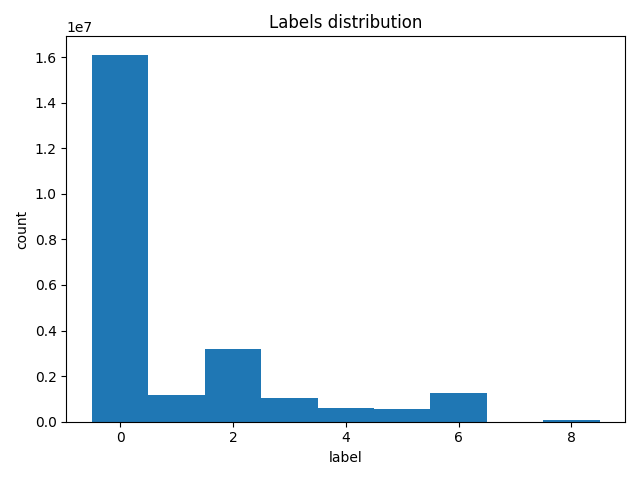

# Отчёт к заданию 1

## Результаты

### Нормализация данных

| № | X | Y | Z | R | G | B | intensivity | label |
|:-:|:---------:|:---------:|:---------:|:--------:|:--------:|:--------:|:---------:|:-:|
| 1 | -0.006240 | -0.203747 | -0.013467 | 0.509804 | 0.572549 | 0.635294 | -0.065912 | 0 |
| 2 | -0.006226 | -0.203774 | -0.014728 | 0.556863 | 0.615686 | 0.698039 | -0.043778 | 0 |
| 3 | -0.006233 | -0.203794 | -0.015342 | 0.564706 | 0.615686 | 0.690196 | -0.138219 | 0 |
| 4 | -0.006233 | -0.203794 | -0.015362 | 0.560784 | 0.611765 | 0.686275 | -0.079685 | 0 |
| 5 | -0.006240 | -0.203794 | -0.015362 | 0.560784 | 0.611765 | 0.686275 | -0.055583 | 0 |

### Распределение меток

  

## Ответы на вопросы

### Дайте определение датасету Semantic3D. Каковы его основные характеристики и для каких задач он предназначен?
Semantic3D — крупномасштабный набор наружных облаков точек, полученных стационарными лазерными сканерами, с покомпонентной семантической разметкой для задач семантической сегментации и классификации точек.

### Чем Semantic3D принципиально отличается от датасетов для 2D-компьютерного зрения (например, ImageNet) и других 3D-датасетов для помещений (таких как S3DIS)?
Отличается модальностью (разреженные 3D‑точки вместо регулярных изображений), геометрией и нерегулярной плотностью, а также масштабом и типом сцен (наружные крупномасштабные сканы против внутренних помещений).

### Опишите состав и структуру датасета. На какие множества (train, test и т.д.) он разделен и какова их цель?
Датасет состоит из нескольких больших сканов (станций) с покомпонентной разметкой; в бенчмарке выделяют тренировочные и тестовые наборы (и валид.) для обучения, валидации и финальной оценки методов.

### Каким способом были получены данные в Semantic3D? Опишите технологию и ее влияние на характеристики облаков точек (плотность, шум, масштаб).
Данные собраны стационарными (terrestrial) лазерными сканерами — это даёт очень плотные и точные облака вблизи сканера, но с изменяющейся плотностью, артефактами сканирования и частичными occlusions на дальних расстояниях. 

### Перечислите и охарактеризуйте 8 семантических классов в датасете. Приведите примеры объектов для каждого класса.
1. **man-made terrain** — искусственное покрытие (тротуары, асфальт).  
2. **natural terrain** — природный рельеф (трава, земля).  
3. **high vegetation** — высокие деревья и крупные кусты.  
4. **low vegetation** — низкая растительность (цветы, мелкие кусты).  
5. **buildings** — здания и постройки (церкви, дома).  
6. **hardscape / remaining hardscape** — искусственные не‑зеленые объекты (площадки, бордюры).  
7. **scanning artifacts** — артефакты сканирования (бликовые/ошибочные точки).  
8. **cars / trucks** — автомобили и грузовики.

### Каковы основные проблемы, связанные с разметкой данных в таком крупномасштабном датасете? (Например, проблема "шума" или "артефактов").
Ручная разметка дорогая и трудоёмкая; ошибки на границах объектов, пропуски и артефакты сканирования приводят к неточным меткам.

### Назовите основные технические проблемы, возникающие при работе с облаками точек такого объема (миллиарды точек).
Ограничения памяти и ввода/вывода, дорогие операции поиска соседей, необходимость даунсэмплинга/батчирования и эффективной индексации.

### Что такое "неравномерная плотность" точек в контексте LiDAR-данных? К каким проблемам при обучении моделей она может привести?
Неравномерная плотность — изменение числа точек на единицу площади в зависимости от расстояния/угла сканирования; приводит к смещению обучения (много данных для близких объектов, мало для дальних), к нестабильным признакам и проблемам с receptive field. 

### Опишите проблему несбалансированности классов в Semantic3D. Как эта проблема влияет на процесс обучения и метрики оценки?
Классы в датасете распределены неравномерно (часто доминируют земля/покрытия), из‑за чего модель склонна давать предсказания для «головных» классов; это ухудшает метрики по редким классам и требует взвешивания/сэмплинга.

### Какие основные этапы предобработки данных необходимы перед использованием Semantic3D для обучения моделей? (Нормализация, даунсэмплинг и т.д.)
Загрузка и проверка целостности, преобразование RGB -> [0,1], нормализация координат (центрирование/масштаб), нормализация интенсивности, очистка/удаление артефактов, даунсэмплинг/стратифицированный сэмплинг, разбиение на train/val/test и, при необходимости, аугментации.
