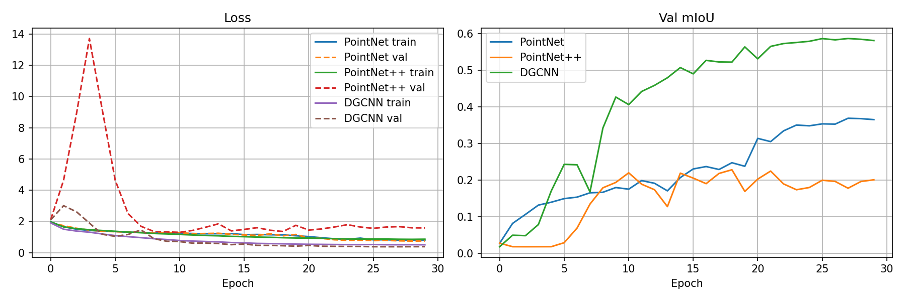
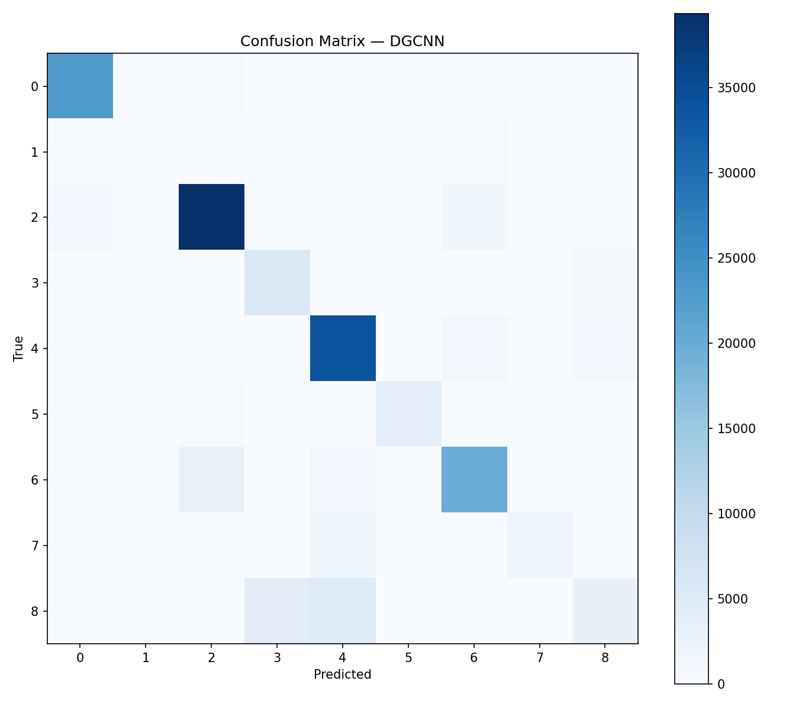
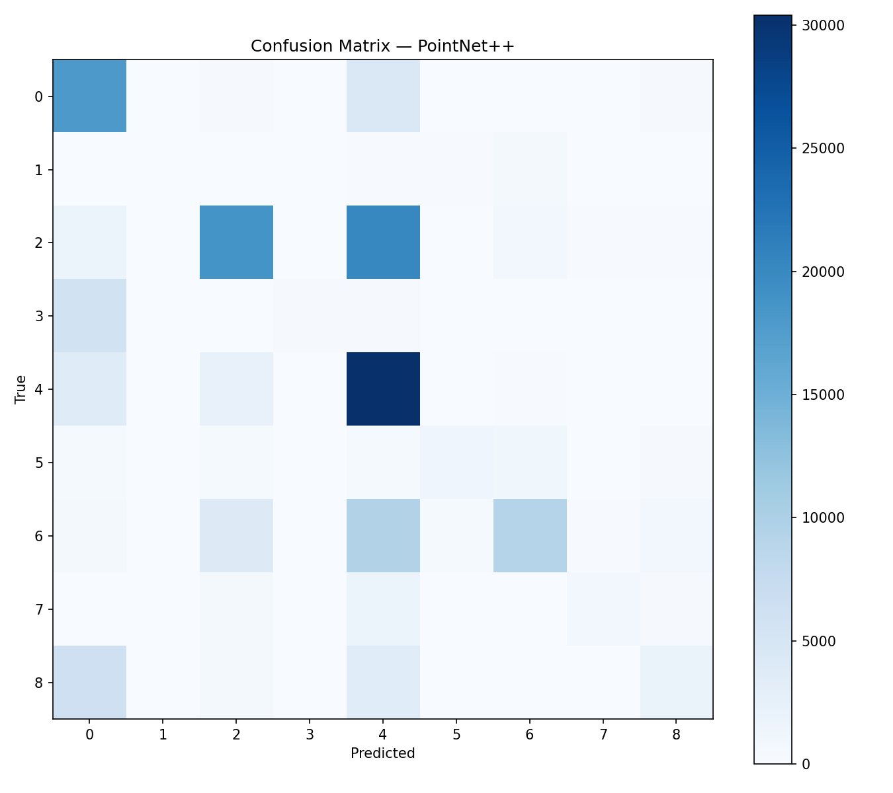
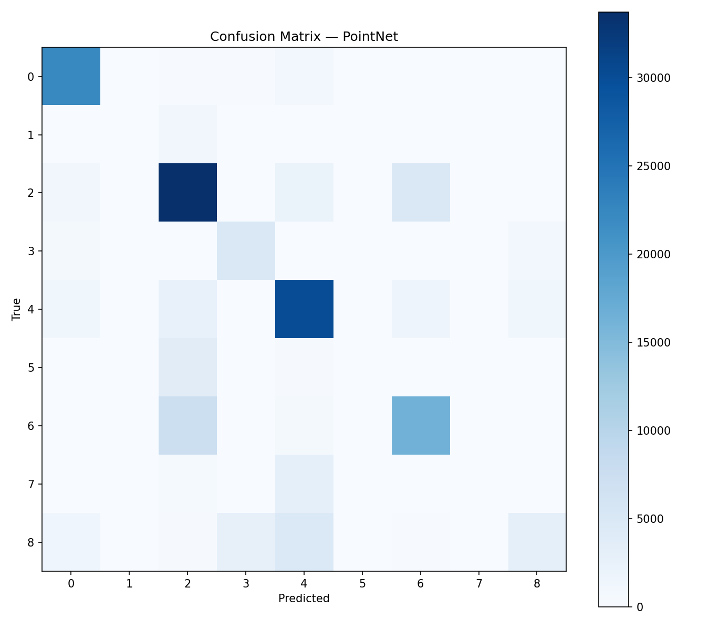
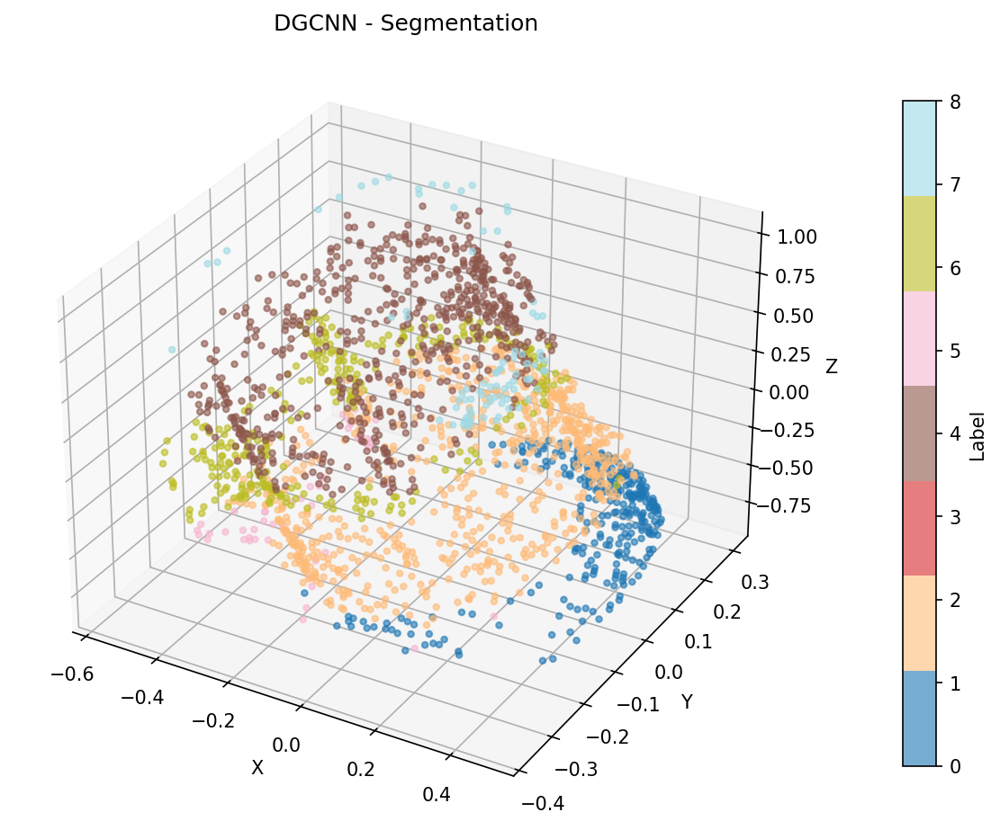

# Point clowd segmentation

## Architectures:

- PointNet
- PointNet++
- DGCNN

## Training logs:

  

## Performance Metrics:

| Model | OA | mIoU | F1 |
|-------|-----|--------|---------|
| PointNet | 0.7179 | 0.3637 | 0.4581 |
| PointNet++ | 0.5232 | 0.2411 | 0.3642 |
| DGCNN | 0.8491 | 0.5835 | 0.6842 |

## Confusion Matrices:

  
  
  

## Inference example:

[valve_0250_lidar_classes](https://kiri4s.github.io/CVin3D12/src/point_clowd_segmentation/results/valve_0250_lidar_classes_segmentation_interactive.html)

  

