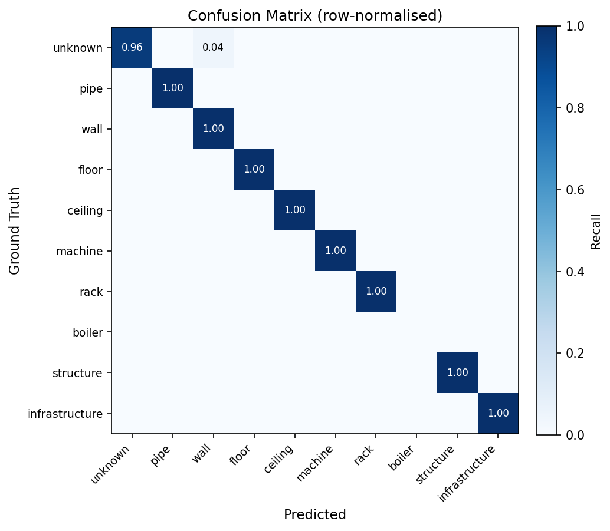

# Semantic Segmentation of LiDAR Point Clouds

Point-wise semantic segmentation of industrial infrastructure LiDAR scans. Default backbone: **PointNet**; DGCNN available as a drop-in alternative.

## Pipeline

```
load PLY → random sample → normalise → PointNet → per-point class logits → CrossEntropy
```

| Module | Responsibility |
|---|---|
| `data/dataset.py` | ASCII PLY reader (pandas), lazy cloud cache, random `num_points` sampling per cloud |
| `models/pointnet.py` | Local MLP → global max-pool → per-point classification head |
| `models/dgcnn.py` | kNN graph + EdgeConv × 4, global max-pool aggregation, per-point classification head |
| `metrics.py` | OA, Macro-F1, mIoU, confusion matrix; saves `metrics.json` |
| `utils.py` | Seed fixing, 19-class colour palette |
| `train.py` | Hydra entry point — train loop, eval every 5 epochs, best checkpoint |
| `aggregate.py` | Reads `metrics.json` from multiple runs → mean ± std summary |
| `visualize.py` | Hydra entry point — GT vs Predicted side-by-side (PNG + PLY, optional Open3D) |

## Data Format

ASCII PLY files with the following vertex properties:

```
x  y  z  label  instance_id  red  green  blue  station_index  circle_index  elevation_deg
```

Model input: **XYZ + RGB** (6 channels). RGB is normalised to `[0, 1]`. Coordinates are centred and normalised per sample.

### Semantic Classes (index = label value)

| # | Class | # | Class |
|---|---|---|---|
| 0 | unknown | 10 | conveyor |
| 1 | pipe | 11 | structure |
| 2 | wire | 12 | infrastructure |
| 3 | wall | 13 | roof |
| 4 | floor | 14 | window |
| 5 | ceiling | 15 | door |
| 6 | machine | 16 | gate |
| 7 | desk | 17 | terrain |
| 8 | rack | 18 | facade |
| 9 | boiler | | |

## Dataset Split

Split is **by scene** (run-folder) — no point from the same scene appears in both train and test.

| Split | Scenes |
|---|---|
| Train | boliler, control, electrical, laboratory, maintenance, office |
| Test | refinery, storage |

## Configuration

All parameters live in `conf/config.yaml`. Key fields:

```
data.root              path to the dataset root folder
data.num_points        points sampled per cloud per iteration  (default: 2048)
data.samples_per_cloud virtual samples drawn from each PLY file (default: 16)
data.train_scenes      list of scene folder names for training
data.test_scenes       list of scene folder names for testing

model._target_         models.pointnet.PointNetSeg (default) | models.dgcnn.DGCNNSeg
model.in_channels      input feature channels                  (default: 6)
model.num_classes      number of semantic classes              (default: 19)
model.dropout          dropout rate in classification head      (default: 0.5)
# DGCNN-only extras (add when switching _target_):
model.k                kNN neighbours in EdgeConv              (default: 20)
model.emb_dims         global feature dimension                (default: 1024)

train.epochs           number of training epochs               (default: 10)
train.batch_size       batch size                              (default: 32)
train.lr               initial learning rate                   (default: 0.001)
train.weight_decay     L2 regularisation                       (default: 1e-4)
train.scheduler        cosine | step                           (default: cosine)
train.class_weights    list of 19 floats or null

seed                   random seed for reproducibility         (default: 42)
```

## Usage

```bash
# Single run (default config — PointNet)
uv run train

# Override any parameter via CLI (Hydra syntax)
uv run train \
    data.root=/path/to/data \
    data.num_points=4096 \
    train.epochs=50 \
    train.batch_size=8

# Switch to DGCNN
uv run train \
    model._target_=models.dgcnn.DGCNNSeg \
    model.k=20 \
    model.emb_dims=1024

# Three independent runs with different seeds (Hydra multirun)
uv run train.py --multirun seed=1,2,3

# Aggregate metrics across runs
uv run aggregate.py multirun/<date>/<time>

# Visualise a test sample: GT vs Predicted
uv run visualize.py \
    checkpoint=outputs/<date>/<time>/best_model.pt \
    viz.sample_idx=0
```

## Output

```
outputs/<date>/<time>/        # single run
  best_model.pt               # checkpoint with best mIoU
  metrics.json                # OA, Macro-F1, mIoU, IoU-per-class, confusion matrix
  .hydra/config.yaml          # exact config of this run
```

## Model Architecture

### PointNet (default)

```
Input (B, N, 6)
  │
  ├─ Conv1d  6 →  64 → BN → ReLU   ┐ local MLP
  ├─ Conv1d 64 →  64 → BN → ReLU   ┘ → local_feat  (B, 64, N)
  │
  ├─ Conv1d  64 →  128 → BN → ReLU  ┐ global MLP
  ├─ Conv1d 128 → 1024 → BN → ReLU  ┘
  ├─ Global max-pool  →  (B, 1024)   broadcast → (B, 1024, N)
  │
  ├─ Cat [local_feat, global_feat]  →  (B, 1088, N)
  ├─ Conv1d 512 → BN → ReLU → Dropout
  ├─ Conv1d 256 → BN → ReLU → Dropout
  └─ Conv1d num_classes
Output (B, N, 19)
```

### DGCNN (alternative)

```
Input (B, N, 6)
  │
  ├─ EdgeConv-1  (6  → 64,  k=20)  dynamic kNN in input space
  ├─ EdgeConv-2  (64 → 64,  k=20)  dynamic kNN in EC-1 feature space
  ├─ EdgeConv-3  (64 → 64,  k=20)
  ├─ EdgeConv-4  (64 → 128, k=20)
  │
  ├─ Concat local features  →  (B, 320, N)
  ├─ Conv1d → BN → LeakyReLU  →  (B, emb_dims, N)
  ├─ Global max-pool  →  (B, emb_dims)  broadcast back to (B, emb_dims, N)
  │
  ├─ Cat [local, global]  →  (B, 320+emb_dims, N)
  ├─ Conv1d 512 → BN → LReLU → Dropout
  ├─ Conv1d 256 → BN → LReLU → Dropout
  └─ Conv1d num_classes
Output (B, N, 19)
```

Each **EdgeConv** block:
1. Builds kNN graph dynamically in the current feature space.
2. Computes edge features `cat(x_j − x_i, x_i)` for each neighbour `j`.
3. Applies a shared MLP (Conv2d) and max-pools over neighbours → per-point feature.

## Results

[refinery / storage sample — interactive visualization](https://kiri4s.github.io/CVin3D12/src/semantic_segmentation/outputs/2026-06-01/first_res/visualization.html)

### Summary (test scenes: refinery, storage)

| OA | Macro-F1 | mIoU |
|---|---|---|
| 0.9971 | 0.4719 | 0.8933 |

### Confusion matrix (row-normalised)


